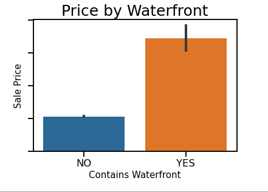
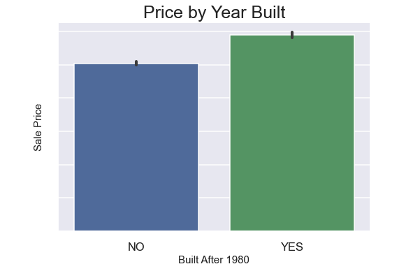

# Real Estate Investing Model:  King County, Washington

## Project Overview

This project uses King County sales data from 2014-2015 to build a linear regression model that helps a real estate investment firm understans how the atrtributes of a home iinfluence the sale price in King COunty, Washington.

## Business Problem

A real estate investment firm is trying to expand their business to the pacific north west.  Considering that they are new to the area they are trying to understand how the housing market works in this new region.  The focus is on King Couty, Washington with the emphasis on understanding how the attributes of homes in this area affect the overall sale price.

## The Data

The data provided to us encompasses over 18,500 home sold in the King County area.  The sales of these homes took place between May of 2014 and May of 2015.  Alongside the sale price, each home has 21 features which describe the interanal as well as external makeup.  Utilizing this data we can understand how the features and attributes which make up a home can coincide with the price the home was sold.

## Model
Model Type: Linear Regression
* Baseline Model: only used features which were highly correlated with the dependent variable. 
* Second Model: Added Categorical features (grade, condition, etc..)
* Third Model: Performed a log transformation on the dependent variable price.
* Fourth Model: Dropped features which has a high p-value.  After creating the fourth model, we looked at multicollinearity
between features.  Sqft_above and sqft_living15 were dropped accordingly.

## Conclusion

The model which is the most accurate in making assumptions of how the attributes of the home increase the sale price is verison four. It is worth noting that since our dependent variable 'price' was log transformed that we need to view the coefficients as percentages.After modeling it is a fair assumption to say that the attributes of the home which will increase the sale price the most are as follows:
* Waterfront will increase the sale price by 39%:

* Homes with a grade of 11 or higher will increase the sale price of them home to that of lesser grades in the range 14% to 33%
* Homes which were built after 1980 will increase the sale price of the home by 21%

## Next Steps

The stakeholder should move forward looking to invest in homes which:
* Were built after 1980
* Are located on the water
* Have a grade of 11 or higher

This will in turn help when they resell the homes in the future. If the stakeholder is looking to add more features in their search in the future, the suggestion would be:
* Homes with multiple floors which increases the sale price by 12%
* Homes which have a view which increases sale price by 15%
